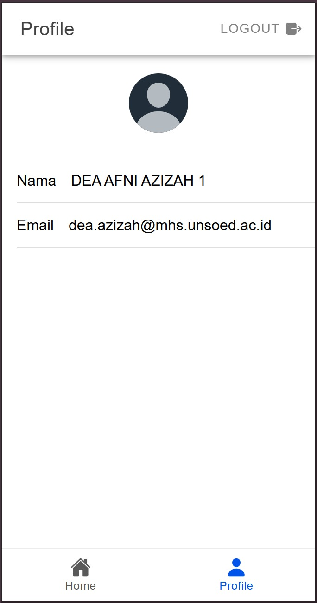

Nama : Dea Afni Azizah

NIM : H1D022093

Shift Baru: C

## Penjelasan Konfigurasi Firebase dan Otorisasi Google

1. Menyiapkan Firebase

Konfigurasikan Firebase dalam file seperti `utils/firebase.ts`. Pastikan Firebase telah diinisialisasi dengan benar dan `auth` dari Firebase telah diimpor untuk mengelola autentikasi pengguna.

2. Login dengan Akun Google
   
**Fitur Login**

Aplikasi memungkinkan pengguna untuk masuk menggunakan akun Google. Di halaman login (`LoginPage.vue`), terdapat tombol yang menjalankan metode `loginWithGoogle` pada `authStore` saat ditekan untuk memulai proses login Google.
Metode `loginWithGoogle` ini berada dalam `authStore`, yaitu store yang mengelola status autentikasi pengguna. Metode ini memicu proses login melalui Firebase, mengizinkan pengguna masuk dengan akun Google mereka.
a. Fungsi `signInWithPopup(auth, provider)` dari Firebase menampilkan jendela popup yang meminta pengguna untuk masuk dengan akun Google. Fungsi ini mengembalikan objek dengan data pengguna yang berhasil login.
b. Setelah berhasil login, data pengguna seperti `displayName`, `email`, dan foto profil akan disimpan dalam `authStore`.

4. Pengelolaan Status Pengguna dengan `authStore`
**Data Pengguna Setelah Login**

Setelah login, informasi pengguna (misalnya nama pengguna, email, dan foto profil) disimpan di `authStore`. Store ini menyimpan status autentikasi dan data yang terkait dengan pengguna (misalnya, apakah pengguna sudah login atau belum).
Setelah login, aplikasi dapat mengakses informasi pengguna seperti nama, email, dan foto profil dari `authStore`.

5. Menampilkan Profil Pengguna
**Halaman Profil**

Di halaman profil (`ProfilePage.vue`), data pengguna yang disimpan di `authStore` akan ditampilkan, termasuk foto profil. Ion-avatar akan digunakan untuk menampilkan gambar profil. Jika foto profil gagal dimuat, aplikasi akan menggunakan gambar default sebagai pengganti.
Pada `ProfilePage.vue`, yang ditampilkan adalah `displayName` dan `email` dari objek pengguna di `authStore`. Foto profil pengguna diambil dari `photoURL` yang disediakan oleh Firebase Authentication.

6. Mengamankan Halaman Khusus Pengguna Login
Untuk memastikan halaman tertentu hanya dapat diakses oleh pengguna yang sudah login, aplikasi menggunakan route guard di `router/index.ts`. Pada bagian ini, sistem akan memeriksa status login pengguna sebelum mengizinkan akses ke halaman tersebut.
Pada mekanisme ini:
- Jika pengguna belum login, aplikasi akan menunggu hingga status autentikasi selesai diperiksa melalui `onAuthStateChanged`.
- Jika sudah login, pengguna akan diarahkan ke halaman utama (`/home`).
- Jika pengguna belum terautentikasi dan mencoba mengakses halaman yang membutuhkan autentikasi (`isAuth: true`), mereka akan diarahkan ke halaman login.

6. Proses Logout
Untuk keluar dari aplikasi, metode `signOut` dari Firebase dapat dipanggil. Fungsi ini akan menghapus sesi pengguna dan mengembalikan status aplikasi ke keadaan sebelum login.

## Alur Proses
1. Pengguna membuka aplikasi dan diarahkan ke halaman login (`LoginPage.vue`).
2. Pengguna menekan tombol "Sign In with Google", yang memicu metode `loginWithGoogle` di `authStore`.
3. `loginWithGoogle` membuka popup untuk login melalui Google. Setelah berhasil, Firebase mengembalikan objek dengan data pengguna seperti `displayName`, `email`, dan `photoURL`.
4. Data pengguna disimpan dalam `authStore`.
5. Halaman profil (`ProfilePage.vue`) akan menampilkan informasi pengguna dari `authStore`, termasuk nama, email, dan foto profil.
6. Setelah login pengguna dapat mengakses halaman profil. Jika pengguna belum login, mereka akan diarahkan kembali ke halaman login.
7. Pengguna bisa logout dan menghapus sesi autentikasi mereka dan mengembalikan mereka ke halaman login.
